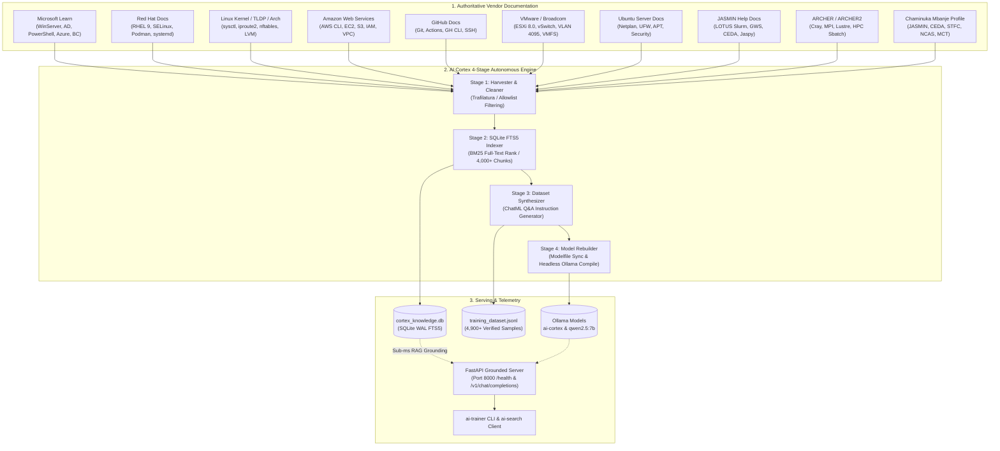

# AI Cortex: Autonomous Multi-Platform Documentation Learning & Training Pipeline

[](https://www.python.org/downloads/)
[](https://ollama.com/)
[](LICENSE)
[]()

Autonomous, unattended documentation ingestion, knowledge indexing, synthetic dataset generation, and model retraining pipeline for private LLM infrastructure. Designed for **Chaminuka Mbanje's** homelab and scientific computing environment (`ai-cortex-01`, subnet `192.168.0.0/24`).

---

## 🏗 System Architecture

The pipeline runs as an autonomous, long-running background daemon (`ai-docs-trainer.service`) that cycles continuously without requiring human intervention. All operations execute with non-interactive **YES** defaults.



---

## 🌟 Key Features

1. **Multi-Platform Authoritative Crawling**:
   - Targets official vendor documentation for: **Microsoft**, **Red Hat**, **Linux (Kernel/TLDP)**, **Amazon Web Services (AWS)**, **GitHub**, **VMware (Broadcom)**, and **Ubuntu Server**.
   - Enforces a strict domain allowlist (`microsoft.com`, `redhat.com`, `kernel.org`, `amazon.com`, `github.com`, `vmware.com`, `ubuntu.com`, `broadcom.com`) to prevent scraping non-authoritative content.

2. **Sub-Millisecond Retrieval-Augmented Grounding (RAG)**:
   - High-performance SQLite database using **FTS5 full-text search** and **BM25 ranking** (`cortex_knowledge.db`).
   - Automatically injects verified technical commands, parameters, and documentation snippets directly into model prompts at inference time.

3. **Continuous Synthetic Q&A Generation**:
   - Parses ingested documentation chunks and synthesizes realistic, scenario-based system administration and DevOps instruction-tuning pairs in **ChatML format**.
   - Over **4,950+ verified samples** generated and appended to `/opt/ai-cortex/data/training_dataset.jsonl`.

4. **Automated Headless Model Recompilation**:
   - Automatically synchronizes `/opt/ai-cortex/Modelfile` with the latest ingested statistics, persona rules, and domain summaries.
   - Recompiles both `ai-cortex:latest` and `qwen2.5:7b` in Ollama non-interactively without user prompts.

5. **Authoritative Professional Profile Grounding**:
   - Integrates the verified professional biography and credentials of **Chaminuka Munashe Mbanje**:
     - Role: **Storage Operations & User Support Specialist at JASMIN** (Centre for Environmental Data Analysis - **CEDA** / National Centre for Atmospheric Science - **NCAS** / Science and Technology Facilities Council - **STFC** / **UKRI**) at the **Rutherford Appleton Laboratory (RAL)** in Oxfordshire, UK.
     - Certifications: Senior **Microsoft Certified Trainer (MCT)**, DevOps Engineer Expert (AZ-400), Dynamics 365 Business Central (MB-800), Azure Data Engineer (DP-203), Azure Security Engineer (AZ-500), MCSA SQL Server.
     - Homelab topology: ESXi Dell R620, TrueNAS ZFS storage, Slurm HPC cluster, and Docker telemetry.

---

## 📂 Repository Structure

```
ai-training/
├── README.md                           # Master Architecture and Quickstart
├── .gitignore                          # Repository ignores (DBs, logs, venvs)
├── Modelfile                           # Production Ollama Modelfile definition
├── docs/
│   ├── ARCHITECTURE.md                 # Deep-dive into the 4-stage pipeline
│   ├── API_REFERENCE.md                # FastAPI endpoint documentation
│   └── OPERATIONS_GUIDE.md             # Daemon and CLI operations guide
├── knowledge_engine/
│   ├── doc_sources.py                  # Seed URLs & queries for 7 vendor domains
│   ├── harvester.py                    # Trafilatura HTML cleaner & domain allowlist
│   ├── knowledge_indexer.py            # SQLite FTS5 database manager & BM25 search
│   ├── dataset_synthesizer.py          # ChatML instruction-tuning Q&A generator
│   ├── modelfile_updater.py            # Modelfile synchronization & Ollama recompiler
│   ├── rag_grounding.py                # High-speed retrieval context injector
│   └── auto_trainer.py                 # Master autonomous training loop daemon
├── server/
│   └── agy_server.py                   # FastAPI grounding service on port 8000
├── client/
│   └── ai-search.py                    # Real-time search & grounded query client
├── bin/
│   └── ai-trainer                      # Bash management CLI (status, cycle, logs, ask)
├── systemd/
│   ├── ai-docs-trainer.service         # Systemd unit for autonomous background training
│   └── ai-cortex.service               # Systemd unit for FastAPI grounding server
├── profiles/
│   └── chaminuka_mbanje_profile.md     # Authoritative professional profile and CV grounding
├── data/
│   └── sample_dataset.jsonl            # Sample ChatML instruction-tuning dataset
└── training/
    ├── README.md                       # Fine-tuning guide (LoRA, MLX)
    ├── train_lora.py                   # PyTorch/TRL LoRA fine-tuning script
    └── train_mlx.sh                    # Apple Silicon MLX training script
```

---

## 🚀 Quickstart & Setup

### 1. Prerequisites
* **Operating System**: Ubuntu Linux 24.04 / 26.04 or Debian-based Linux.
* **Python**: Python 3.10+ with `virtualenv`.
* **Inference Engine**: [Ollama](https://ollama.com/) with `qwen2.5:7b` pulled (`ollama pull qwen2.5:7b`).

### 2. Installation
```bash
# Clone the repository
git clone https://github.com/chaminukambanje/ai-training.git /opt/ai-cortex

# Create virtual environment
python3 -m venv /opt/ai-cortex/venv
source /opt/ai-cortex/venv/bin/activate

# Install required dependencies
pip install fastapi uvicorn httpx pydantic trafilatura beautifulsoup4 lxml duckduckgo_search
```

### 3. Systemd Service Deployment (Unattended 24/7 Execution)
```bash
# Deploy systemd service units
sudo cp systemd/ai-cortex.service /etc/systemd/system/
sudo cp systemd/ai-docs-trainer.service /etc/systemd/system/
sudo cp bin/ai-trainer /usr/local/bin/ai-trainer
sudo chmod +x /usr/local/bin/ai-trainer

# Enable and start services
sudo systemctl daemon-reload
sudo systemctl enable --now ai-cortex.service
sudo systemctl enable --now ai-docs-trainer.service
```

---

## 🛠 Management & Operations (`ai-trainer` CLI)

The `ai-trainer` utility provides instant telemetry, log streaming, and manual triggering:

```bash
# 1. View live learning metrics and knowledge stats
ai-trainer status

# 2. Stream real-time background training and harvesting logs
ai-trainer logs

# 3. Trigger an immediate unattended learning cycle
ai-trainer cycle

# 4. Ask a technical question against the grounded local model
ai-trainer ask "How do I configure static IP bonding in Netplan on Ubuntu?"
```

---

## 📡 API & Client Usage

### Querying via `ai-search.py` (From Any Client Workstation)
```bash
# Example query
python3 client/ai-search.py "What are VMware ESXi best practices for vSwitch promiscuous mode and port mirroring?"
```

### Direct HTTP API (`/v1/chat/completions`)
```bash
curl -s http://192.168.0.235:8000/v1/chat/completions \
  -H "Content-Type: application/json" \
  -d '{
    "model": "ai-cortex",
    "messages": [
      {"role": "user", "content": "How do I manage SELinux booleans on Red Hat Enterprise Linux?"}
    ],
    "require_verification": false
  }'
```

### Health & Telemetry (`/health`)
```bash
curl -s http://192.168.0.235:8000/health | python3 -m json.tool
```

```json
{
    "status": "healthy",
    "service": "ai-cortex",
    "node": "ai-cortex-01",
    "gemini_grounding_active": true,
    "local_engine": "ollama (ai-cortex)",
    "training_dataset_samples": 4951,
    "knowledge_base": {
        "documents": 234,
        "chunks": 4053,
        "domains": {
            "aws": 32,
            "chaminuka_mbanje": 1,
            "github": 26,
            "linux": 27,
            "microsoft": 34,
            "redhat": 10,
            "ubuntu": 43,
            "vmware": 61
        }
    }
}
```

---

## 👤 Author & Maintainer

* **Chaminuka Munashe Mbanje** (`mbanjec`)
* **Role**: Storage Operations & User Support Specialist, JASMIN (CEDA / NCAS / STFC / UKRI)
* **Location**: Oxfordshire, United Kingdom
* **Website**: [https://chaminuka.npcsolutions.co.uk](https://chaminuka.npcsolutions.co.uk)
* **GitHub**: [@chaminukambanje](https://github.com/chaminukambanje)
* **LinkedIn**: [chaminukambanje](https://www.linkedin.com/in/chaminukambanje/)

---

## 📜 License
This project is open-source software licensed under the **MIT License**.
